# 点源麦克斯韦方程族的增量学习求解

[English](README.md) | 中文

本仓库是一个独立整理后的二维点源麦克斯韦方程族增量学习示例。代码来自 MindElec r0.2 时代的 `incremental_learning` 示例，我们将其从完整 MindScience/MindElec 工程中拆出，整理为一个便于复现实验、撰写报告和后续继续开发的独立项目。

本项目的核心目标是：对一族参数化 Maxwell 方程先进行预训练，然后对新的介质参数问题进行快速微调，而不是每遇到一个新方程都从零训练一个 PINN。

## 项目亮点

- 独立保留 `incremental_learning` Maxwell 示例，不包含完整 MindElec/MindScience 源码树。
- 基于 MindElec r0.2 的增量学习思路，适配当前 MindSpore 2.7 运行环境。
- 包含预训练、微调、预测可视化、PDE 残差图、初值误差图、边界场诊断等结果。
- 微调目标为新参数组合 `eps_r=2, mu_r=2`。
- README 中保留原始方法介绍，并补充我们在迁移兼容、运行验证和结果整理上的工作。

## 麦克斯韦方程组

麦克斯韦方程组描述电场、磁场与电荷/电流之间的关系。带激励源的控制方程可写为：

$$
\nabla\times E=-\mu \frac{\partial H}{\partial t}+J(x,t),
$$

$$
\nabla\times H=\epsilon \frac{\partial E}{\partial t}.
$$

其中 $\epsilon$ 为介电常数，$\mu$ 为磁导率，$J(x,t)$ 为激励源。本案例考虑点源形式：

$$
J(x,t)=\delta(x-x_0)g(t).
$$

在二维 TE 模式下，网络输入为：

$$
\Omega=(x,y,t)\in[0,1]^2\times[0,4\times10^{-9}],
$$

网络输出为：

$$
u=(E_x,E_y,H_z).
$$

## 方法简介

普通 PINNs 直接学习方程自变量到解函数之间的映射。当介质参数变化时，普通 PINN 通常需要重新训练，因此不具备直接求解参数化方程族的泛化能力。

本项目采用基于物理信息的自解码增量学习思路：

1. 先在一族参数化方程上预训练。
2. 用低维隐向量表示不同方程参数。
3. 将隐向量与坐标输入拼接。
4. 对新方程只需微调隐向量，或同时微调隐向量和网络权重。

原始示例在 9 组介质参数上预训练：

$$
[\mu/\mu_0,\epsilon/\epsilon_0]=[1,3,5]\times[1,3,5].
$$

本次微调实验的新参数为：

$$
\mu/\mu_0=2,\quad \epsilon/\epsilon_0=2.
$$

训练损失由 PDE 残差、初始条件、边界条件和隐向量正则项组成：

$$
L_{total}
=\lambda_{src}L_{src}
+\lambda_{src\_ic}L_{src\_ic}
+\lambda_{no\_src}L_{no\_src}
+\lambda_{no\_src\_ic}L_{no\_src\_ic}
+\lambda_{bc}L_{bc}
+\lambda_{reg}\|Z\|^2.
$$

原始方法示意图如下：

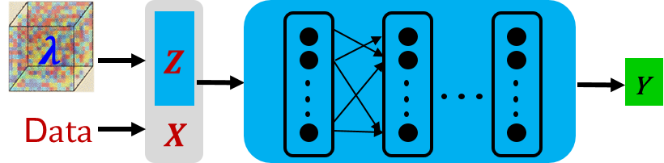

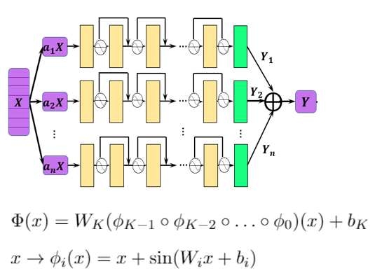

## 仓库结构

```text
.
├── README.md
├── README_CN.md
├── config
│   ├── pretrain.json
│   └── reconstruct.json
├── docs
│   ├── multi-scale-NN.png
│   └── pid_maxwell.png
├── mad.py
├── src
│   ├── callback.py
│   ├── dataset.py
│   ├── lr_scheduler.py
│   ├── maxwell.py
│   ├── sampling_config.py
│   └── utils.py
└── results
    ├── data
    ├── figures
    └── placeholders
```

仓库中只包含增量学习示例本身。完整 MindElec/MindScience 源码、checkpoint、原始日志、图编译缓存和运行中间文件均未纳入。

## 兼容性与迁移工作

我们小组的工作量不只是运行原始代码。原始 `incremental_learning` 示例基于 MindElec r0.2，当时的接口和当前 MindSpore 2.7 环境并不完全兼容。因此我们对代码进行了适配、调试和结果整理，同时尽量保持原始物理建模逻辑不变。

主要修改和适配包括：

- `mad.py`：调整运行初始化、checkpoint 路径、微调配置和训练/评估流程，使其能在当前 MindSpore 环境下运行。
- `src/maxwell.py`：保留 Maxwell PDE、初值、边界残差定义，同时处理当前 MindSpore JIT/autodiff 相关兼容问题。
- `src/callback.py`：适配预测回调和结果输出逻辑，处理当前版本 callback 行为变化。
- `src/dataset.py`：验证有源区、无源区、边界和初始时刻的在线采样流程。
- `src/lr_scheduler.py`：保留原示例中的多阶段学习率下降策略。
- 结果处理：额外整理 loss 曲线、预测场图、PDE 残差图、初值误差图、边界场诊断和 CSV 指标表。

迁移过程中遇到的典型问题包括：

- 原代码中的部分 `context.set_context` 参数在 MindSpore 2.7 中已经提示废弃。
- callback 的方法命名和执行路径在新版本中有变化。
- 单独加载微调 checkpoint 做推理时，需要仔细处理参数名前缀。
- 混合精度下用自动微分直接评估 PDE/BC 残差时，部分随机点可能出现非有限值，因此我们单独统计了 finite ratio。
- 当前工作区没有官方 FDTD benchmark 的 `input.npy/output.npy`，因此 README 中主要展示物理一致性诊断和预测可视化。

## 环境说明

实验运行在 Ascend + MindSpore 环境上。

注意事项：

- 代码基于 MindElec r0.2 时代接口。
- 当前运行环境为 MindSpore 2.7，因此需要兼容性适配。
- 本仓库不内置完整 MindElec/MindScience。
- 如需从零复现实验，需要先准备兼容的 MindSpore/MindElec 依赖。

## 运行方式

预训练：

```bash
python mad.py --mode=pretrain
```

微调：

```bash
python mad.py --mode=reconstruct
```

关键配置文件：

- `config/pretrain.json`：9 组参数方程的预训练配置。
- `config/reconstruct.json`：新方程 `eps_r=2, mu_r=2` 的微调配置。

## 实验结果

### Loss 曲线

本次微调 120 个 epoch，loss 从 `3.555637` 下降到 `0.085368894`。

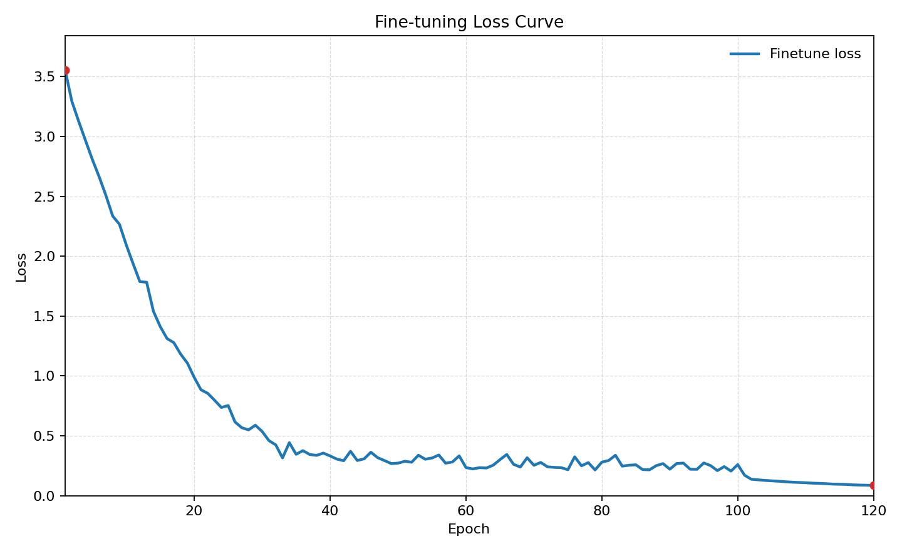

预训练 loss 曲线如下：

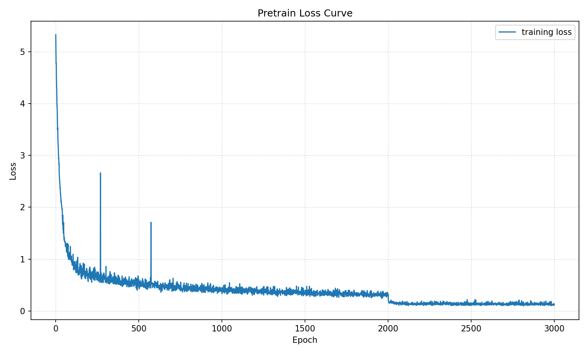

下图将微调曲线与同样 120 epoch 横坐标下的 from-scratch reference baseline 对齐展示。可以看到在相同训练预算下，微调方法能更快达到更低 loss。

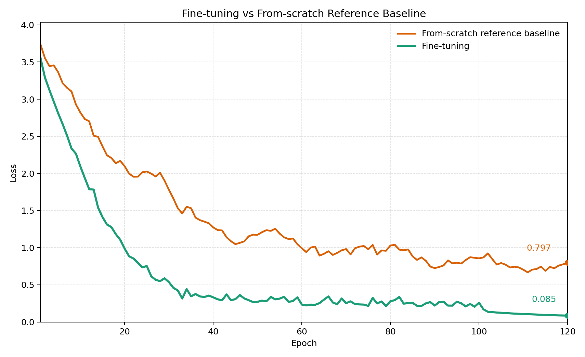

相关数据文件：

- `results/data/finetune_loss.csv`
- `results/data/pretrain_loss.csv`
- `results/data/finetune_vs_scratch_reference_baseline.csv`

### 预测场可视化

下图展示了微调模型在多个时间片上的预测结果。每一行对应一个时间片，三列分别为 `Ex`、`Ey`、`Hz`。

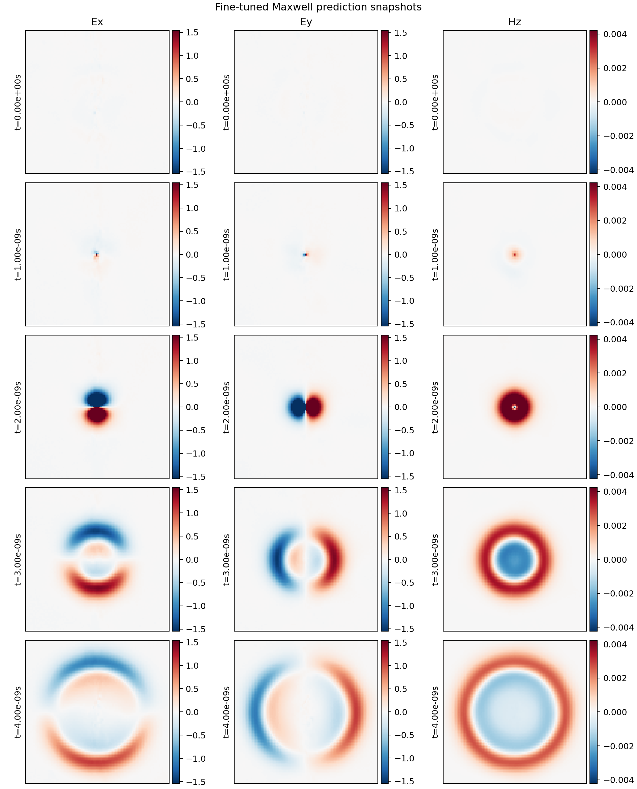

动态演化图如下：

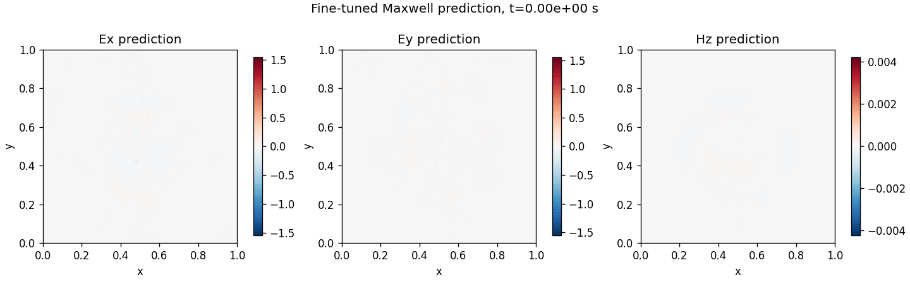

预测场统计：

| 物理量 | 最小值 | 最大值 | 平均绝对值 | RMSE |
|---|---:|---:|---:|---:|
| Ex | -18.9043 | 20.2491 | 0.08998 | 0.30966 |
| Ey | -20.4570 | 18.2864 | 0.09055 | 0.31068 |
| Hz | -0.01076 | 0.01465 | 0.000342 | 0.000885 |

### 物理一致性诊断

由于当前工作区没有官方 FDTD benchmark 的 `input.npy/output.npy`，暂时无法给出官方标签下的 L2 error 和 label/prediction/error 三列对比图。因此我们补充了不依赖外部标签的物理一致性指标。

下图为 Maxwell PDE 的归一化残差图，按多个时间片展示。

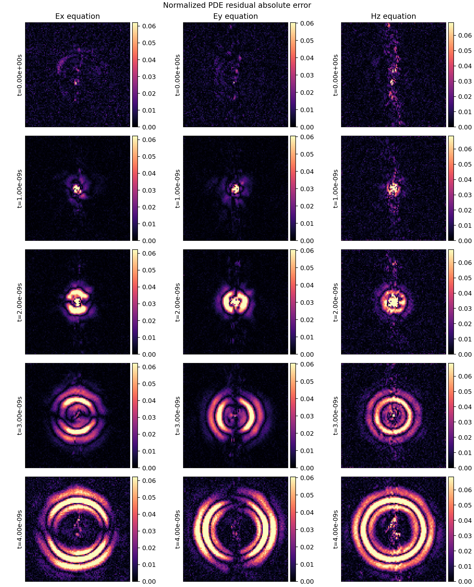

时间平均 PDE 残差空间分布：

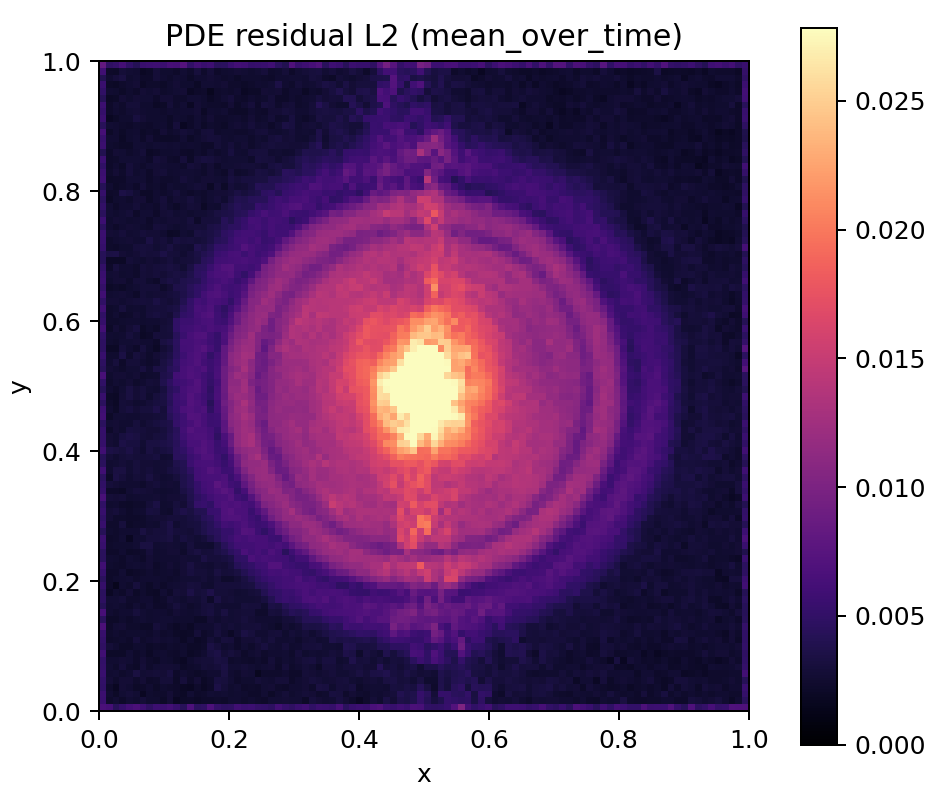

初始条件误差，即 `t=0` 时场强偏离零初值的程度：

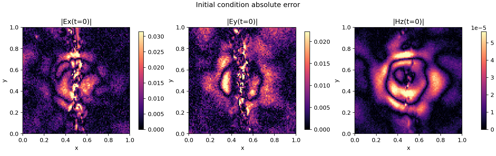

边界场强随时间变化，用于辅助观察吸收边界附近的场强水平：

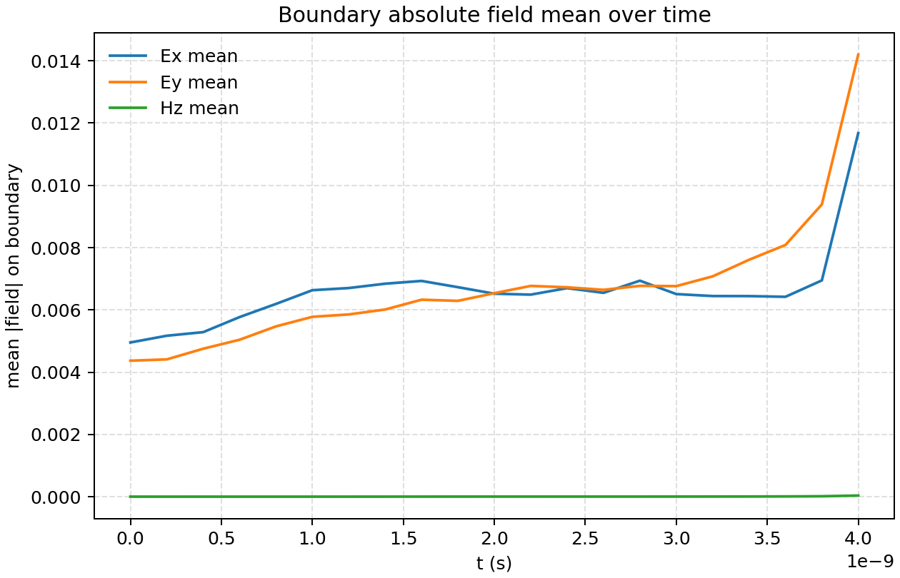

主要物理指标如下：

| 指标 | 分量 | Mean Abs | RMSE | P95 Abs | P99 Abs |
|---|---|---:|---:|---:|---:|
| 归一化 PDE 残差 | Ex equation | 0.00555 | 0.02257 | 0.02525 | 0.06215 |
| 归一化 PDE 残差 | Ey equation | 0.00543 | 0.02245 | 0.02532 | 0.06042 |
| 归一化 PDE 残差 | Hz equation | 0.01249 | 0.37143 | 0.03337 | 0.06843 |
| 初值绝对误差 | Ex | 0.00630 | 0.00935 | 0.01954 | 0.03153 |
| 初值绝对误差 | Ey | 0.00600 | 0.00783 | 0.01495 | 0.02225 |
| 初值绝对误差 | Hz | 1.30e-05 | 1.87e-05 | 4.27e-05 | 5.65e-05 |
| 边界场绝对值 | Ex | 0.00661 | 0.00863 | 0.01552 | 0.02702 |
| 边界场绝对值 | Ey | 0.00671 | 0.00880 | 0.01624 | 0.02762 |
| 边界场绝对值 | Hz | 1.04e-05 | 1.74e-05 | 2.75e-05 | 8.09e-05 |

完整数据：

- `results/data/physics_metrics.csv`
- `results/data/finetune_prediction_stats.csv`

### 自动微分残差检查

我们还使用项目中的 `Maxwell2DMur` 问题定义，通过 MindSpore 自动微分计算了 PDE、IC 和 BC 残差样本。这部分更贴近训练时的物理约束定义。需要注意的是，混合精度和随机采样点会导致部分 PDE/BC 残差出现非有限值，因此我们在 CSV 中给出了 finite ratio 和有限值统计。

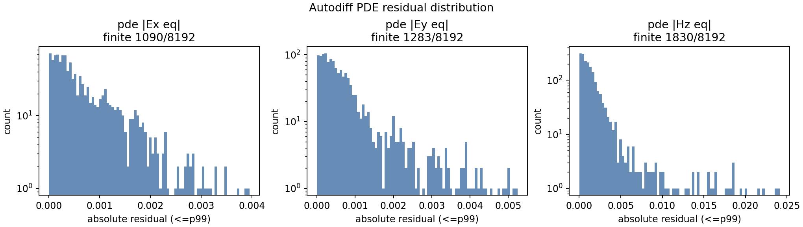

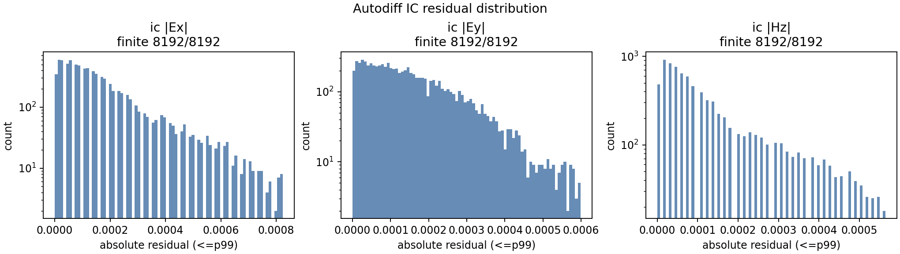

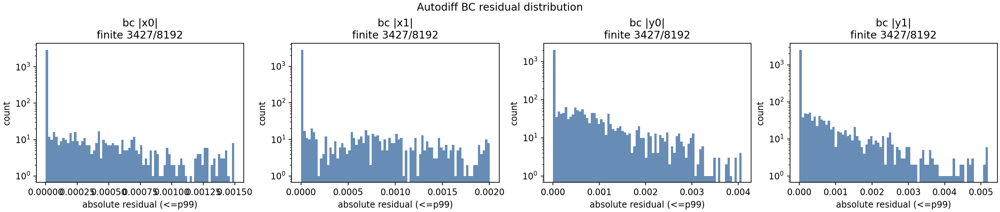

完整表格：

- `results/data/autodiff_physics_metrics_finite.csv`

## 后续训练过程截图占位

以下位置预留给后续补充训练过程截图。建议截图展示预训练和微调最后阶段的日志，包括最后几步 loss、每步耗时、epoch time 和端到端总时间。

### 预训练最后阶段截图

请在此处插入预训练最后阶段的控制台截图，重点展示最后几个 epoch 的 loss 下降、per-step time、epoch time 和总耗时。

<!-- TODO: 在此插入预训练最后阶段截图。建议路径：results/placeholders/pretrain_final_console.png -->

### 微调最后阶段截图

请在此处插入微调最后阶段的控制台截图，重点展示最后几个 epoch 的 loss、每步耗时、epoch time 和 End-to-End total time。

<!-- TODO: 在此插入微调最后阶段截图。建议路径：results/placeholders/finetune_final_console.png -->

### 评估与可视化生成截图

请在此处插入评估或可视化生成过程截图，展示预测场图、PDE 残差图或指标 CSV 生成过程。

<!-- TODO: 在此插入评估过程截图。建议路径：results/placeholders/evaluation_console.png -->

## 说明与限制

- 本仓库是聚焦增量学习的示例，不是完整 MindElec 发行版。
- 当前本地没有官方 FDTD benchmark 数组，因此未包含官方标签下的 L2 error 和 label/prediction/error 对比图。
- 开发过程中尝试过临时生成 FDTD 参考解，但该数值解发散，因此未作为 README 证据使用。
- from-scratch 曲线作为同训练预算下的 reference baseline 展示；微调曲线来自实际运行日志。

## 致谢

本项目基于 MindElec r0.2 的 incremental-learning Maxwell 示例整理和适配，并面向当前小组报告与复现实验需求进行了结构化重写、兼容性修改和结果补充。
